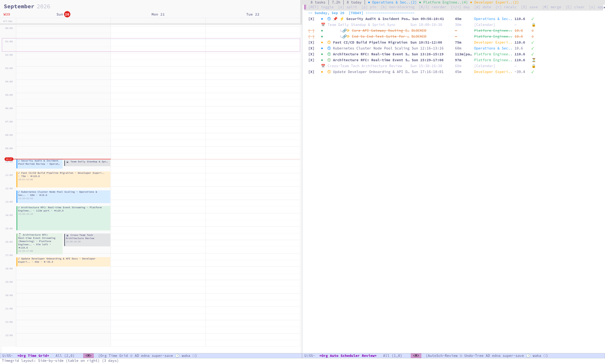
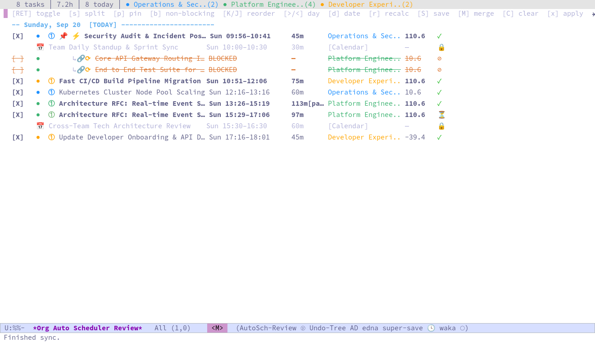

* Org Auto Scheduler

*Automatically schedule your Org mode tasks — so you can focus on doing, not planning.*

Org Auto Scheduler scores tasks by priority, deadline, effort, state, and category; topologically sorts them via dependency-aware Kahn's algorithm; and packs them into your available time windows — respecting time blocks, repeater conflicts, and task blockers.

#+begin_quote
Tag it =AUTOSCH=, press a key, and your day is planned.
#+end_quote

#+CAPTION: Interactive Side-by-Side Timegrid & Review Table View

** Table of Contents

- [[#features-at-a-glance][Features at a Glance]]
- [[#installation][Installation]]
- [[#quick-start][Quick Start]]
- [[#key-commands][⚡ Key Commands]]
- [[#how-tasks-are-selected][How Tasks Are Selected]]
- [[#task-properties][Task Properties]]
- [[#how-scoring-works][How Scoring Works]]
- [[#how-sorting-works][How Sorting Works]]
- [[#review-and-apply-buffer][Review & Apply Buffer]]
  - [[#column-table-view][Column Table View]]
  - [[#visual-timeline--org-timegrid-integration][Visual Timeline & Org Time Grid Integration]]
  - [[#fixed-agenda-events-and-non-blocking-tasks][Fixed Agenda Events & Non-Blocking Tasks]]
  - [[#persistent-review-decisions-and-state-file][Persistent Review Decisions & State File]]
  - [[#smart-restore--merge][Smart Restore & Merge]]
  - [[#multi-instance-and-file-synchronization][Multi-Instance & File Synchronization]]
  - [[#review-keybindings][Review Keybindings]]
- [[#schedule-adherence-tracking][Schedule Adherence Tracking]]
- [[#background-scheduling][Background Scheduling]]
  - [[#safe-schedule-preservation--smart-start-buffer][Safe Schedule Preservation & Smart Start Buffer]]
  - [[#interactive-title-modifiers][Interactive Title Modifiers (-r-, -s-, -f-, -p-, -x-, -kill-, -e<dur>-, -+1d-, -#A-, -#B-, -#C-, -i-, -\i-)]]
  - [[#automatic-task-displacement][Automatic Displacement by Newly Added Tasks]]
  - [[#background-run-change-logging][Background Run Change Logging]]
- [[#historical-effort-tracking][Historical Effort Tracking]]
- [[#repeater--habit-integration][Repeater / Habit Integration]]
- [[#recurring-tasks][Recurring Tasks]]
- [[#splittable-tasks--multi-day-placeholders][Splittable Tasks & Multi-Day Placeholders]]
- [[#dynamic-real-time-adaptation--execution][Dynamic Real-Time Adaptation & Execution]]
  - [[#collision-aware-smart-bump-engine][Collision-Aware Smart Bump Engine]]
  - [[#early-done-gap-pull][Early-Done Gap Pull (Auto-Filling Freed Slots)]]
  - [[#overrun-modeline-indicator--quick-extend-command][Overrun Modeline Indicator & Quick Extend Command]]
  - [[#pomodoro-workrest-interval-weaving][Pomodoro Work/Rest Interval Weaving]]
- [[#protected-daily-catch-up--slack-window][Protected Daily Catch-Up / Slack Window]]
- [[#customization-reference][Customization Reference]]
  - [[#review-buffer-and-state-file-settings][Review Buffer & State-File Settings]]
  - [[#splittable-task-settings][Splittable Task Settings]]
- [[#debugging][Debugging]]
- [[#contributing][Contributing]]
- [[#license][License]]

** Features at a Glance

- *Smart Scoring:* Multi-factor scoring (priority, deadline urgency, effort, category, state).
- *Dependency-Aware Sorting:* Topological sort via Kahn's algorithm respects =BLOCKER= / =DEPENDS_ON= chains.
- *Interactive Review Buffer:* Preview, reorder, toggle, and approve proposed schedules with a structured Column Table and optional visual =org-timegrid= timeline integration.
- *Non-Blocking Calendar Support:* Mark fixed events as non-blocking so tasks can be scheduled concurrently in those time windows.
- *Persistent Review Decisions & State File:* Save custom orderings, skipped tasks, and target dates across sessions with automatic multi-instance sync and smart restore-and-merge.
- *Splittable Tasks & Multi-Day Placeholders:* Tasks tagged =:SPLITTABLE:= schedule today's available chunk and pin temporary placeholder subtasks across subsequent days for remaining effort. Preserves clocked time into parent tasks, syncs with CalDAV/Google Calendar, and auto-cleans each morning.
- *Schedule Adherence Tracking:* Morning snapshots + evening scoring with streaks, category breakdowns, partial credit, and a "Squirrel" penalty for unplanned work.
- *Modeline Integration:* Live adherence score displayed in your Emacs mode line.
- *Background Scheduling:* Auto-reschedule silently while Emacs is idle.
- *Safe Schedule Preservation:* Tasks scheduled for today remain anchored and won't endlessly slide forward on background idle syncs.
- *Interactive Mobile & CalDAV Title Modifiers:* Use quick title prefixes like =(-r-)=, =(-s-)=, =(-\s-)=, =(-f-)=, =(-\f-)=, =(-p-)=, =(-\p-)=, =(-x-)=, =(-kill-)=, =(-e30m-)=, =(-+1d-)=, =(-#A-)=, =(-#B-)=, =(-#C-)=, =(-i-)=, =(-\i-)=, or =(-r-all-)= to reschedule, set priority, make independent of siblings, pin/unpin, toggle splitting, or adjust effort from any mobile calendar without editing Org property drawers. Markers are automatically processed, applied, and stripped clean from the headline.
- *Automatic Task Displacement:* Newly added unscheduled =AUTOSCH= tasks automatically take their place among upcoming unpinned tasks based on priority/score, while past (lapsed), current (in-progress), and pinned tasks remain strictly fixed.
- *Critical Path Method (CPM) & Float Analysis:* Computes forward/backward passes ($LS - ES$) on task dependency DAGs to identify bottlenecks, applying a score boost (=⚡=) to critical path tasks.
- *Soft Project Batching:* Heuristically clusters tasks from the currently active project within a score tolerance (default 15%) to eliminate jarring context switching.
- *Smart Non-Blocking Title Regexp:* Automatically treats calendar events matching patterns like Lunch, Gym, Commute, OOO as non-blocking free time, with explicit =:NON_BLOCKING: nil= overrides.
- *Protected Daily Catch-Up / Slack Window:* Configurable daily slack window (e.g. 16:00–17:00) that standard tasks skip over, while allowing lightweight =:FREESET: t= tasks to schedule into it.
- *Smart Start Buffer:* 0-minute immediate scheduling when actively clocked into a task, and a 5-minute buffer when unclocked.
- *Historical Effort Learning:* Learns from your actual vs. estimated times per category.
- *Time & Energy Blocks:* Hard and soft constraints for context-based scheduling.
- *Repeater / Habit Awareness:* Projects repeater occurrences into the conflict map.
- *Recurring Task Generation:* Automatic sub-task creation for daily/weekly/monthly patterns.
- *Smart Bump Engine:* Push the current task and downstream agenda items forward by $N$ minutes, jumping cleanly over fixed meetings and rolling over at workday end.
- *Early-Done Gap Pull:* Marking a task =DONE= early auto-pulls or prompts to pull upcoming tasks forward to close empty schedule gaps.
- *Overrun Modeline & Extend:* Non-intrusive =[Overrun +Xm ⚠️]= mode line indicator when clocked tasks exceed schedule, paired with quick extend command (=C-c a e=).
- *Task-Scoped Pomodoro Work & Break Intervals:* Explicit Pomodoro pacing (=:POMODORO: <work>:<break>=) splits demanding tasks into focused work intervals and weaves restful break gaps without creating fake dummy tasks. Non-Pomodoro tasks remain unaffected.

** Installation

*** Manual Installation

Clone the repository:

#+begin_src shell
git clone https://github.com/SSD2019/org-auto-scheduler.git
#+end_src

Add to your Emacs configuration:

#+begin_src emacs-lisp
(add-to-list 'load-path "/path/to/org-auto-scheduler")
(require 'org-auto-scheduler)
#+end_src

#+begin_src emacs-lisp
(use-package org-auto-scheduler
  :ensure t
  :vc (:url "https://github.com/SSD2019/org-auto-scheduler"
			:rev :newest))
#+end_src 

*** Dependencies

- Emacs 27.1+
- =org-mode= (built-in)
- =log4e= (available on MELPA: =M-x package-install RET log4e=)

** Quick Start

1. Add the =AUTOSCH= tag to any task you want auto-scheduled.
2. Set an =Effort= property (e.g. =0:30= for 30 minutes).
3. Run one of the key commands below.

*Recommended key bindings:*

#+begin_src emacs-lisp
(global-set-key (kbd "C-c a s") #'org-auto-scheduler-schedule-tasks)
(global-set-key (kbd "C-c a r") #'org-auto-scheduler-review-and-apply)
(global-set-key (kbd "C-c a d") #'org-auto-scheduler-dispatch)
#+end_src

** ⚡ Key Commands
<<key-commands>>

These are the most important interactive commands you will use day-to-day.

*** 🧭 =M-x org-auto-scheduler-dispatch=

Open the *command dispatch menu* (uses =transient= when installed, falling back to a lightweight interactive prompt). From here you can trigger scheduling, preview review, save/restore review decisions, score adherence, bump tasks, or toggle non-blocking events with single keystrokes.

#+begin_src emacs-lisp
M-x org-auto-scheduler-dispatch
#+end_src

*** 🗓️ =M-x org-auto-scheduler-schedule-tasks=

Run the full scheduler and *immediately apply* timestamps to your Org files. This is the "just do it" command — it scores, sorts, and schedules everything in one shot.

#+begin_src emacs-lisp
M-x org-auto-scheduler-schedule-tasks
#+end_src

*** 🔍 =M-x org-auto-scheduler-review-and-apply=

Preview the proposed schedule in the *interactive review buffer* before applying. You can toggle tasks on/off, reorder them across days, toggle non-blocking calendar events, inspect the visual timeline, and recalculate times — then press =x= to apply.

#+begin_src emacs-lisp
M-x org-auto-scheduler-review-and-apply
#+end_src

See [[#review-and-apply-buffer][Review & Apply Buffer]] for full keybindings.

*** 📸 =M-x org-auto-scheduler-snapshot-schedule=

Take a *morning snapshot* of today's planned schedule. This records what you planned so the adherence scorer can later compare it to what actually happened.

#+begin_src emacs-lisp
;; Run this each morning after your schedule is set
M-x org-auto-scheduler-snapshot-schedule
#+end_src

*** 📊 =M-x org-auto-scheduler-score-schedule=

Score today's schedule adherence against the morning snapshot. Shows completion rates, missed tasks, unplanned work ("Squirrel" penalty), category breakdowns, and your current streak.

#+begin_src emacs-lisp
;; Run this in the evening (or midday for a live check)
M-x org-auto-scheduler-score-schedule

;; Score a past day (prompted for date)
C-u M-x org-auto-scheduler-score-schedule
#+end_src

*** 📈 =M-x org-auto-scheduler-adherence-report=

Display the full adherence report buffer for today (or a specific date). Includes time-of-day analysis, rollover warnings, and Hall of Fame stats.

#+begin_src emacs-lisp
M-x org-auto-scheduler-adherence-report
#+end_src

*** All Interactive Commands

| Command                                             | Description                                                                                |
|-----------------------------------------------------+--------------------------------------------------------------------------------------------|
| =org-auto-scheduler-schedule-tasks= ⭐              | Run full scheduler, apply timestamps immediately.                                          |
| =org-auto-scheduler-review-and-apply= ⭐            | Preview schedule in interactive review buffer.                                             |
| =org-auto-scheduler-dispatch= ⭐                    | Open interactive command menu (Transient UI for quick dispatch).                          |
| =org-auto-scheduler-review-save-decisions=          | Persist current review order, skips, target dates, and non-blocking state to state file.  |
| =org-auto-scheduler-review-restore-and-merge=       | Restore saved review decisions and merge with live Org modifications.                      |
| =org-auto-scheduler-clear-saved-decisions=          | Clear saved review decisions (all, skipped, order, non-blocking, or task at point).        |
| =org-auto-scheduler-toggle-non-blocking=           | Toggle non-blocking status for task/event at point across Org, Agenda, Review, or Calendar. |
| =org-auto-scheduler-agenda-toggle-non-blocking=     | Toggle non-blocking status for the agenda item at point (=C-c C-x n= in Org Agenda).       |
| =org-auto-scheduler-snapshot-schedule= ⭐            | Snapshot today's planned tasks for adherence tracking.                                     |
| =org-auto-scheduler-score-schedule= ⭐              | Score adherence against the morning snapshot.                                               |
| =org-auto-scheduler-adherence-report= ⭐            | Display full adherence report buffer.                                                       |
| =org-auto-scheduler-debug=                          | Run scheduler with debug logging, then open the log buffer.                                |
| =org-auto-scheduler-toggle-background=              | Toggle idle/background auto-scheduling on or off.                                          |
| =org-auto-scheduler-setup-background=               | Manually (re-)initialize the idle timer.                                                   |
| =org-auto-scheduler-historical-insights=            | Show per-category effort-estimate accuracy multipliers.                                    |
| =org-auto-scheduler-show-repeater-projections=      | Display projected repeater/habit occurrences.                                              |
| =org-auto-scheduler-clear-repeater-cache=           | Invalidate the repeater-projections cache.                                                 |
| =org-auto-scheduler-bump-agenda=                    | Push the agenda item at point and subsequent AUTOSCH tasks forward with collision-aware repacking. |
| =org-auto-scheduler-extend-current-task= ⭐          | Extend current task effort (default 15m) and repack downstream tasks (=C-c a e=).          |
| =org-auto-scheduler-overrun-mode-line-enable=       | Enable subtle overrun indicator in the Emacs mode line.                                    |
| =org-auto-scheduler-overrun-mode-line-disable=      | Disable overrun indicator in the mode line.                                                |
| =org-auto-scheduler-cleanup-placeholders=           | Clean up temporary placeholder subtasks and migrate any clock lines to parent tasks.       |
| =org-auto-scheduler-validate-config=                | Verify configuration consistency.                                                          |
| =org-auto-scheduler-adherence-mode-line-enable=     | Show live adherence score in the Emacs mode line.                                          |
| =org-auto-scheduler-adherence-mode-line-disable=    | Remove adherence score from the mode line.                                                 |
| =org-auto-scheduler-adherence-generate=             | Regenerate adherence scores for all available snapshot dates.                               |

**** Backward-compatible aliases

| Old name                                     | Current name                                     |
|----------------------------------------------+--------------------------------------------------|
| =org-auto-scheduler-show-habit-projections=  | =org-auto-scheduler-show-repeater-projections=   |
| =org-auto-scheduler-clear-habit-cache=       | =org-auto-scheduler-clear-repeater-cache=        |

** How Tasks Are Selected

A task is eligible for scheduling when it has:
- The =AUTOSCH= tag, *and*
- A TODO state that appears as a key in =org-auto-scheduler-state-weights=, *and*
- Does *not* carry the =ARCHIVE= tag, *and*
- Does *not* carry the =AUTOSCH_PLACEHOLDER= tag or property (placeholders are managed automatically).

Tasks blocked by incomplete =BLOCKER= / =DEPENDS_ON= dependencies are skipped unless all blocking tasks have already been scheduled in the current session.

** Task Properties

These properties go inside the task's =:PROPERTIES:= drawer.

| Property                  | Values                                          | Description                                                                        |
|---------------------------+-------------------------------------------------+------------------------------------------------------------------------------------|
| =NOT_BEFORE=              | Org timestamp (e.g. =<2025-06-01 Sun 09:00>=)  | Earliest allowed scheduling time for this task.                                    |
| =RECURRING=               | =daily= / =weekly= / =bi-weekly= / =monthly=   | Creates sub-task instances for each upcoming occurrence.                           |
| =SPLITTABLE=              | =t= / =yes=                                     | Allows task to be split across days if remaining effort exceeds available time.    |
| =MIN_CHUNK=               | Integer (minutes)                               | Minimum duration required for today's slice of a splittable task (default: 30).    |
| =PINNABLE=                | =t= / =yes=                                     | Marks task as pinnable to a specific time during review reordering.                |
| =PINNED_TIME=             | =HH:MM= or =YYYY-MM-DD HH:MM=                   | Pinned start time (allows exceeding day hours, splits at midnight if needed).     |
| =BLOCKER=                 | Space-separated org-id strings                  | This task won't be scheduled before all listed tasks are DONE or scheduled.        |
| =DEPENDS_ON=              | Space-separated org-id strings                  | Alias for =BLOCKER=. Both properties are combined.                                 |
| =INHERITED_PRIORITY=      | Integer                                         | Adds a flat bonus to the task's priority score. Inherited from parent headings.    |
| =PROJECT_PRIORITY=        | Integer                                         | Explicit priority for the whole project (set on the =:PROJECT:= heading).          |
| =PROJECT_INTERLEAVE=      | =t= / =yes= / =nil= / =no=                     | Override interleaving policy for this project. Unset = use global default.         |
| =ORDERED=                 | =t= / =yes= / =nil= / =no=                      | Sibling ordering policy on parent headings. When =nil= or =no=, subtasks are scheduled concurrently by score. |
| =PARALLEL=                | =t= / =yes= / =nil= / =no=                      | Set on parent to schedule subtasks concurrently in parallel, or on an individual task to decouple it from siblings. |
| =INDEPENDENT=             | =t= / =yes=                                     | Decouples this task from sibling outline sequencing chains, allowing it to schedule as soon as its score permits. |
| =PROJECT_ORDERED=         | =t= / =yes= / =nil= / =no=                      | Project-wide default for whether subtasks under headings are sequential (=t=) or parallel (=nil=). |
| =PROJECT_PARALLEL=        | =t= / =yes= / =nil= / =no=                      | Project-wide default to allow subtasks across the project to be scheduled concurrently in parallel (=t=). |

*** Example

#+begin_src org
* Project Alpha :PROJECT:
  :PROPERTIES:
  :ID: proj-alpha-root
  :END:

** Architecture & Design
   :PROPERTIES:
   :ORDERED: nil    ; Siblings under this heading are scheduled concurrently by score, not outline order
   :END:

*** TODO [#A] High-Impact Core Architecture :AUTOSCH:
    :PROPERTIES:
    :Effort: 2:00
    :END:

*** TODO [#C] Background Research Docs :AUTOSCH:
    :PROPERTIES:
    :Effort: 1:00
    :END:

* TODO Deploy feature :AUTOSCH:
  :PROPERTIES:
  :NOT_BEFORE: <2026-04-01 Wed 10:00>
  :BLOCKER:   abc123-id-of-review-task
  :Effort:    1:30
  :END:

* TODO Long Architecture Proposal :AUTOSCH:SPLITTABLE:
  :PROPERTIES:
  :Effort:    4:00
  :MIN_CHUNK: 45
  :END:
#+end_src

** How Scoring Works

Each task receives a composite score:

#+begin_example
score = (effort × effort_weight)
      + ((priority_score + inherited_priority) × priority_weight)
      + (1 / (1 + days_to_deadline) × urgency_weight)
      + (category_weight × 10)
      + state_weight
      + hard_deadline_boost   ; applied when deadline ≤ hard_deadline_days away
#+end_example

- *Priority score*: =A= → 10, =B= → 0, =C= → −5, none → 0
- *State weight*: from =org-auto-scheduler-state-weights=
- *Category weight*: from =org-auto-scheduler-category-weights=
- *Effort*: actual effort × historical multiplier (if tracking is on)
- *=buffertime= tag*: applies a 15-minute gap around the task instead of the default =org-auto-scheduler-task-gap=

** How Sorting Works

Tasks are sorted with an advanced DAG topological sort (Kahn's algorithm) augmented with *Critical Path Method (CPM) Float Analysis* and *Soft Project Batching*:

1. Explicit =BLOCKER= / =DEPENDS_ON= edges — a task comes after its blockers.
2. Implicit sibling ordering — tasks with the same parent inside the same project
   keep their textual outline order by default (=org-auto-scheduler-siblings-sequential=).
   Siblings can be scheduled concurrently in parallel (prioritized by score instead
   of outline position) by setting =:ORDERED: nil= or =:PARALLEL: t= on the parent heading,
   =:PROJECT_ORDERED: nil= on the project root, or =:INDEPENDENT: t= on a specific task.
3. Project-level priority (=PROJECT_PRIORITY= property).
4. *Critical Path & Float Time Analysis (CPM):*
   When =org-auto-scheduler-critical-path-enabled= is =t= (default), the scheduler performs a forward pass to compute Early Start (=ES=) and a backward DAG pass from project endpoints to compute Late Start (=LS=). The difference ($LS - ES$) gives the *Total Float* in hours. Tasks with zero or near-zero float ($\le$ =org-auto-scheduler-critical-path-max-float-hours=, default 0.5 hours) are critical bottlenecks whose delay would postpone the entire project chain. These tasks:
   - Receive a substantial score boost (=org-auto-scheduler-critical-path-boost=, default =+50.0=) to schedule before non-critical tasks.
   - Are marked with a =⚡= symbol in the scheduling reports and review buffer.
5. *Project Batching / Context-Switch Affinity:*
   When multiple unblocked tasks are available across different projects, the scheduler prefers tasks matching the currently active project if their score is within =org-auto-scheduler-project-batching-tolerance= (default =0.15= / 15%) of the top-scoring task. This prevents rapid ping-pong context switching between unrelated projects while still respecting significant priority differences and deadlines.
6. Per-project interleaving:
   - When interleaving is *on* (default), tasks from different projects are
     merged by score and project batching tolerance.
   - When interleaving is *off*, projects are scheduled as contiguous blocks,
     ordered by each project's *maximum task score*.
7. Individual score as the final tiebreaker.

Circular dependencies are detected; cyclic tasks are appended at the end with
a depth marker of 99 as a warning signal.

** Review & Apply Buffer
<<review-and-apply-buffer>>

=M-x org-auto-scheduler-review-and-apply= (or =C-c a r=) runs the scheduler in *preview mode*
(nothing is written to your Org files) and opens the =*Org Auto Scheduler Review*=
buffer.

The review buffer lets you inspect proposed schedules, move tasks between slots and days,
toggle fixed calendar events as non-blocking, preview the schedule in an interactive weekly grid
via =org-timegrid= (=T=), and save decisions across sessions.

*** Column Table View
<<column-table-view>>

#+CAPTION: Org Auto Scheduler Standalone Review Buffer (Table View)

A structured list grouped by day with day header statistics (e.g. =─── Today (Monday, 2026-09-21) [3h 45m planned] ───=):

| Column      | Description                                                                                          |
|-------------+------------------------------------------------------------------------------------------------------|
| =Apply=     | =[X]= means the task will be applied; =[ ]= means skip.                                              |
| =●=         | Color-coded dot representing the project. Fixed events show =📅=.                                    |
| =Task Name= | Headline (flat visual list; project colors define identity).                                         |
| =Time=      | Calculated schedule string (e.g., =Mon 09:15 – 10:45=).                                               |
| =Duration=  | Task duration in minutes (annotated with =[?]= if estimated).                                        |
| =Project=   | Human-readable project name or tag badge for calendar events.                                       |
| =Score=     | Composite scheduling score (=—= for fixed calendar events).                                          |
| =Status=    | Status indicator: =✓= (success), =⚠= (warning), =✗= (failed), =🔒= (blocking fixed event).          |

*** Visual Timeline & Org Time Grid Integration
<<visual-timeline--org-timegrid-integration>>

#+CAPTION: Interactive Side-by-Side Timegrid Layout (visual calendar on left, review table on right with live bi-directional sync)

Pressing =T= inside the review buffer toggles the visual timeline integration powered by =org-timegrid=.
- *Bi-directional Sync:* Changes made in either view (toggling tasks, reordering, pinning) immediately refresh both the calendar tiles and the review table.
- *Dual Layouts (=i=):* Toggle between a 3-day side-by-side split (calendar on left, review table on right) and a 7-day horizontal split (calendar on top, review table below).
- *Keyboard Drag & Reorder:* Move tasks earlier or later with =K= and =J=, jump across days with =>= and =<=, or drag before another task with =O=.
- *Pinned & Splittable Blocks:* Pinned tasks and multi-day placeholder chunks are rendered directly onto the calendar grid alongside your fixed agenda meetings.

*** Fixed Agenda Events and Non-Blocking Tasks
<<fixed-agenda-events-and-non-blocking-tasks>>

By default, existing scheduled tasks or timestamps in your agenda files that do *not* have the =AUTOSCH= tag are treated as *fixed agenda events*.
- You can toggle showing or hiding these events in the review buffer by pressing =E=.
- *Blocking Events (=🔒=):* By default, fixed events block auto-scheduler slots. No tasks will be placed during their scheduled window.
- *Non-Blocking Events:* Many calendar events (such as all-hands meetings, webinars, optional office hours, or background listening sessions) do not require exclusive focus. Marking an event as *non-blocking* tells the scheduler that this time slot remains available for scheduling work.

**** Smart Auto-Detection via Title Regexp:
Calendar entries with titles matching =org-auto-scheduler-auto-non-blocking-regexp= are automatically treated as non-blocking without requiring any manual tagging or properties:
#+begin_src emacs-lisp
;; Default regexp matches common personal and tentative calendar blocks:
(setq org-auto-scheduler-auto-non-blocking-regexp
      "\\b\\(?:Lunch\\|Dinner\\|Gym\\|Workout\\|Tentative\\|OOO\\|Out of Office\\|Commute\\|Travel\\|Break\\)\\b")
#+end_src
- *Explicit Override (=:NON_BLOCKING: nil=):* If you have a calendar meeting that matches the regexp but *must* be treated as strictly blocking (e.g. an important "Working Lunch" or "Client Dinner"), simply add =:NON_BLOCKING: nil= (or =no=, =false=, =0=) to the heading's property drawer. Explicit property values always override title heuristics.

**** How to Toggle Non-Blocking Status:
- *In the Review Buffer:* Move point to the fixed event row and press =b= (or =SPC= / =m=). The lock icon =🔒= is removed and =[NB]= is appended to the project tag.
  - Press =r= to immediately recalculate the schedule; auto-scheduler will pack tasks into the freed time window!
- *In Org Agenda:* Move point to any non-AUTOSCH event and press =C-c C-x n= (or =C-c C-x N=).
- *Universal Command:* Call =M-x org-auto-scheduler-toggle-non-blocking= from any buffer (Org file headline, Agenda, Review, or Calendar).

Non-blocking states are automatically stored according to =org-auto-scheduler-non-blocking-backend= (by default in both the review state file and the =AUTOSCH_NON_BLOCKING= Org headline property).

*** Persistent Review Decisions and State File
<<persistent-review-decisions-and-state-file>>

When organizing a full week, you often make careful manual adjustments in the review buffer:
reordering tasks (=U= / =D=), deferring items to specific days (=d=, =>=, =<=), skipping tasks (=SPC= / =m=),
or toggling non-blocking events (=b=).

Org Auto Scheduler persists these review decisions so you never lose your manual planning:
- *State File Location:* Saved to =org-auto-scheduler-review-state-file= (defaults to =~/.emacs.d/org-auto-scheduler-review-state.el=).
- *Automatic Persistence:* When applying with =x= (=org-auto-scheduler-review-execute=), all decisions are saved automatically (controlled by =org-auto-scheduler-review-auto-save-decisions=, default =t=). State is also saved cleanly when exiting Emacs via =kill-emacs-hook=.
- *Manual Save:* Press =S= or =C-c C-s= (=org-auto-scheduler-review-save-decisions=) anytime in the review buffer.
- *Clearing Saved Decisions:* Press =C= or =C-c C-d= (=org-auto-scheduler-clear-saved-decisions=) to reset decisions. You can choose to clear:
  - =all=: Clear all custom orders, skips, target dates, and non-blocking marks.
  - =skipped=: Reset only skip flags (unskips all tasks).
  - =order=: Reset only manual ordering back to default score-based order.
  - =non-blocking=: Reset all non-blocking marks back to blocking events.
  - =task=: Clear saved decisions for the specific task at point.

*** Smart Restore & Merge
<<smart-restore--merge>>

If you edit Org files during the day (adding new tasks, changing TODO states, or checking off items), you can press =M= or =C-c C-m= (=org-auto-scheduler-review-restore-and-merge=).

Rather than wiping out your manual schedule or creating inconsistencies, the merge algorithm:
1. *Preserves Manual Order:* Retains your custom task order and day placements for all active tasks.
2. *Prunes Completed Tasks:* Automatically removes tasks marked =DONE= or deleted from your files.
3. *Sibling Outline Interpolation:* Newly added tasks are slotted next to their outline siblings based on tree position.
4. *Score & Project Anchoring:* If a new task has no outline siblings in the queue, it is placed near existing tasks of the same project according to its priority/deadline score.
5. *Smart Un-skip:* If a task was previously skipped in review, but you changed its TODO keyword to =NEXT= or gave it a manual schedule timestamp, it is automatically un-skipped.

*** Multi-Instance and File Synchronization
<<multi-instance-and-file-synchronization>>

If you run Emacs on multiple devices (e.g. desktop and laptop synchronized via Git, Syncthing, Dropbox, or iCloud) or have background idle scheduling active:
- *External Modification Detection:* =org-auto-scheduler= tracks the state file's file-system modification time (=mtime=).
- *Automatic Two-Way Reconciliation:* Before saving or loading, if the file on disk is newer than the in-memory timestamp, it parses the disk changes and merges them with in-memory decisions.
- *Timestamp-Based Conflict Resolution:* Each task decision carries an internal =:updated-at= timestamp. Newer decisions supersede older ones on a per-task basis, preventing accidental clobbering or dropped tasks.

*** Review Keybindings
<<review-keybindings>>

| Action                                | =*Org Auto Scheduler Review*= | =*Org Time Grid*=    | Notes                                                   |
|---------------------------------------+-------------------------------+----------------------+---------------------------------------------------------|
| *Toggle task application*             | =RET=, =m=                    | =RET=, =m=           | Toggle =[X]= / =[ ]=; updates grid/table live           |
| *Jump to Org heading*                 | =TAB=                         | =TAB=                | Open task or event heading in Org file                  |
| *Select Next / Prev Block*            | =n= / =p= (line nav)          | =n= / =p=            | Native timegrid block selection protected from Evil     |
| *Day Backward / Forward*              | =<= / =>=                     | =b= / =f=            | Native timegrid day navigation preserved                |
| *Jump to Date / Today*                | =d=                           | =j= / =.=            | Protected from Evil modal shadowing                     |
| *Page Down*                           | =SPC=, =C-v=                  | =SPC=, =C-v=         | Standard scrolling / leader key preserved               |
| *Pin Task*                            | =P=, =p=                      | =P=                  | Prompt for time; pre-filled with preview; =C-u= unpins  |
| *Move Before Task*                    | =O=                           | =O=                  | Pick target task by name (keyboard drag)                |
| *Toggle Non-Blocking (Fixed Events)*  | =B=, =b=                      | =B=                  | Toggle 🔒 on fixed agenda event                         |
| *Toggle SPLITTABLE*                   | =s=                           | =s=                  | Toggle =[s]= property (splits across gaps/days)         |
| *Toggle FREESET*                      | =F=                           | =F=                  | Toggle ⚡ property (off-hours flexible; midnight split)  |
| *Edit Effort (What-If)*               | =e=                           | =e=                  | Edit effort in minutes (redirects chunks to parent)     |
| *Undo Review Action*                  | =U=, =u=                      | =U=                  | Restore overrides, entries, and tasks; refresh grid     |
| *Move Up / Earlier*                   | =K=                           | =K=                  | Move earlier in scheduling order (crosses days)         |
| *Move Down / Later*                   | =J=, =D=                      | =J=, =D=             | Move later in scheduling order (crosses days)           |
| *Shift Day Next / Prev*               | =>=, =+= / =<=, =-=           | =>=, =+= / =<=, =-=  | Move task across scheduled days                         |
| *Recalculate Schedule*                | =r=, =C-c C-r=                | =r=, =C-c C-r=       | Recalculate and compact schedule                        |
| *Refresh Scheduler*                   | =R=                           | =R=                  | Re-run auto-scheduler from scratch                      |
| *Apply Schedule*                      | =x=, =C-c C-c=                | =x=, =C-c C-c=       | Commit scheduled times to Org files                     |
| *Save Decisions*                      | =S=, =C-c C-s=                | =S=, =C-c C-s=       | Save order, skip, pin, and non-blocking decisions       |
| *Restore Decisions*                   | =M=, =C-c C-m=                | =M=, =C-c C-m=       | Restore decisions across sessions                       |
| *Clear Decisions*                     | =C=, =C-c C-d=                | =C=, =C-c C-d=       | Clear saved decisions                                   |
| *Toggle Fixed Agenda Events*          | =E=                           | =E=                  | Toggle visibility of fixed calendar events              |
| *Toggle Timegrid Open/Close*          | =T=                           | =T=                  | Toggle open/close calendar split                        |
| *Toggle Timegrid Layout*              | =i=                           | =i=                  | Toggle 3-day side-by-side vs horizontal split           |
| *Help*                                | =?=                           | =?=                  | Show unified interactive help reference                 |

**** Unified Review & Timegrid Shortcuts
Every core schedule-review shortcut works identically when focused in either the review table or the visual =*Org Time Grid*=:
- In the timegrid, native navigation keys remain untouched: =n= / =p= select next/previous task block, =b= / =f= navigate days, =j= / =.= jump to date/today, and =SPC= / =C-v= page down.
- Pressing =RET= or =m= in either view toggles the selected task between included and skipped.
- Pressing =P= in the timegrid prompts to pin the task start time (leaving lowercase =p= as previous block; both =P= and =p= work in the review table).
- Pressing =U= (or =u= in review) triggers Auto-Scheduler review undo in both views (restoring overrides, table entries, and task schedules; in timegrid, lowercase =u= is reserved for native timegrid tile undo).
- Pressing =e= prompts to adjust estimated effort for What-If scenario planning (editing a placeholder chunk redirects to the parent task).
- Pressing =B= in the timegrid (or =B= / =b= in review) toggles non-blocking status on fixed agenda events.
- Reordering (=K=, =J=, =D=, =>=, =<=, =d=, =O=) and timegrid mouse dragging swap rows and update layout instantaneously (<5ms), debouncing schedule recalculation until input pauses for 3 seconds (configurable via =org-auto-scheduler-review-recalculate-delay=; press =r= to recalculate immediately).
- Global actions (=r=, =x=, =S=, =M=, =C=, =E=) execute directly on the selected task block and auto-refresh the grid.
- Pressing =i= toggles the timegrid layout between a 3-day side-by-side view (timegrid on the left with 3 days, review tableview on the right) and the default horizontal split (timegrid on top with 7 days, tableview below). The preferred default and number of days can be configured via =org-auto-scheduler-review-timegrid-layout= and =org-auto-scheduler-review-timegrid-side-by-side-days=.

**** Evil / Spacemacs Compatibility
All review and timegrid unified keybindings (including navigation keys =n=, =p=, =b=, =f=, =j=, =.=, reordering =K=, =J=, =D=, actions =U=, =P=, =p=, =O=, =F=, =s=, =B=, =b=, =S=, =M=, =C=, =T=, =i=, =g=, =q=, and prefix keys =f= and =*=) are natively bound in Evil's =normal= and =motion= states, ensuring seamless modal editing without key collisions.

*** Filtering Commands (Prefix: =f= or =/=)

- =f t= : Show only tasks scheduled for today.
- =f p= : Filter tasks by project (prompts with autocompletion).
- =f a= : Clear active filters and show all tasks.
- =/=   : Filter tasks using an interactive regular expression matching headlines.

*** Bulk Marking Commands (Prefix: =*=)

- =* a= : Mark all visible tasks.
- =* n= : Unmark/clear all visible tasks.
- =* t= : Mark all tasks scheduled for today.
- =* p= : Mark all tasks belonging to a specific project.
- =* %= : Mark all tasks matching a regular expression.

*Note:* Pressing =x= always recalculates times from the current visual order before writing to Org files, so you never need to manually press =r= before applying.

** Schedule Adherence Tracking

Track how well you stick to your daily schedule and earn a daily adherence score.

*** Daily Workflow

*1. Morning — Take a Snapshot:*

Run =M-x org-auto-scheduler-snapshot-schedule= when your daily schedule is ready. This records all scheduled tasks planned for the day. The snapshot loads automatically on startup.

*2. Evening — Score Yourself:*

Run =M-x org-auto-scheduler-score-schedule=. This compares the morning snapshot to your actual completed work.

*** Scoring Features

- *Time-Gated Midday Scoring:* Score yourself in the middle of the day — the algorithm only considers tasks whose scheduled start-time has already passed, so you won't be penalized for afternoon tasks.
- *Retroactive Scoring:* Forgot to score yesterday? Call =M-x org-auto-scheduler-score-schedule= with a prefix argument (=C-u M-x ...=) or answer the interactive prompt to score any day from the past 30 days.
- *Category Breakdown:* See adherence percentages split by category.
- *Partial Credit:* Credit for effort spent even if the task isn't marked =DONE= (requires =org-clock=).
- *Time-of-Day Analysis:* Flags missed or rescheduled tasks alongside their scheduled time to help identify when your schedule breaks down.
- *The "Squirrel" Penalty:* Tracks tasks you completed but didn't plan for.
- *Rollover Warnings:* Detects tasks pushed from yesterday's snapshot to today's.
- *Hall of Fame:* Tracks and displays your best adherence days over the last 7 days, 30 days, and 1 year.

Adherence data and streaks are saved to =org-auto-scheduler-adherence-file=.

*** Modeline Integration

Display a live, running adherence score directly in your Emacs mode line. It updates every 5 minutes.

#+begin_src emacs-lisp
(org-auto-scheduler-adherence-mode-line-enable)
#+end_src

To disable: =M-x org-auto-scheduler-adherence-mode-line-disable=.

** Background Scheduling
<<background-scheduling>>

When enabled, the scheduler runs silently while Emacs is idle, without popping
up the report buffer.

#+begin_src emacs-lisp
(setq org-auto-scheduler-background-enabled t)
(setq org-auto-scheduler-idle-time 300)          ; wait 5 min of idle before first run
(setq org-auto-scheduler-background-interval 300) ; re-run every 5 min of continuous idle
(setq org-auto-scheduler-background-async t)     ; run in asynchronous background thread (non-blocking)

;; Schedule preservation and buffer settings
(setq org-auto-scheduler-preserve-today-scheduled t) ; keep today's schedule stable (default t)
(setq org-auto-scheduler-start-buffer-minutes 5)     ; start 5m ahead when unclocked (0m when clocked)

;; Restrict to specific machines (optional)
(setq org-auto-scheduler-allowed-hostnames '("work-laptop" "home-pc"))
#+end_src

Toggle at runtime with =M-x org-auto-scheduler-toggle-background=.

*** Safe Schedule Preservation & Smart Start Buffer
<<safe-schedule-preservation--smart-start-buffer>>

In background scheduling, a common frustration is that unclocked tasks constantly slide into =now + buffer= when you step away from your desk, leading to endless shifting across the day.

Org Auto Scheduler solves this with *Safe Preservation* (=org-auto-scheduler-preserve-today-scheduled=, enabled by default):
- *Stability by Default:* Tasks already scheduled for today remain anchored at their existing times during background runs.
- *Smart Start Buffer:* When scheduling starts for new or rescheduled tasks:
  - If you are *currently clocked in* to a task: buffer is *0 minutes* (starts immediately at =now=).
  - If *not clocked in*: adds *5 minutes* buffer (=org-auto-scheduler-start-buffer-minutes=).
- *Force Full Replan:* If you ever want to completely wipe and recalculate today's schedule from scratch, call =C-u M-x org-auto-scheduler-schedule-tasks= (or prefix =C-u= with your keybinding).

*** Interactive Title Modifiers (-r-, -s-, -\s-, -f-, -\f-, -p-, -\p-, -x-, -kill-, -e<dur>-, -+1d-, -#A-, -#B-, -#C-, -i-, -\i-)
<<interactive-title-modifiers>>

When syncing with mobile calendar apps (via =org-caldav=, Google Calendar, or Nextcloud), you often need to reschedule or modify a task directly from your phone without opening Org property drawers.

You can add lightweight modifier markers directly to the task title in any calendar app or Org headline:

| Marker | Flag | Effect |
|--------+------+--------|
| =-r-= or =(-r-)= | *Reschedule Cascade* | Reschedules this task and all subsequent tasks today in their previously scheduled relative order. Tasks scheduled before it remain preserved. Pinned tasks stay fixed at their =PINNED_TIME=. |
| =-s-= or =(-s-)= | *Enable Splittable* | Marks the task as =SPLITTABLE= (sets =:SPLITTABLE: t= and adds =:SPLITTABLE:= tag). |
| =-\s-= or =(-\s-)= | *Remove Splittable* | Unsets the =SPLITTABLE= behavior (deletes =:SPLITTABLE:= property and removes =:SPLITTABLE:= tag). |
| =-f-= or =(-f-)= | *Enable Freeset* | Marks the task as =FREESET= (allows scheduling outside normal workday hours or across midnight; sets property and tag). |
| =-\f-= or =(-\f-)= | *Remove Freeset* | Unsets the =FREESET= behavior (deletes =:FREESET:= and =:PINNABLE:= properties and removes tags). |
| =-p-= or =(-p-)= | *Pin Task* | Pins the task to the incoming/updated scheduled time (sets =:PINNED: t=, records =:PINNED_TIME:=, adds =:PINNED:= tag), locking it from being moved. |
| =-\p-= or =(-\p-)= | *Unpin Task* | Unpins the task (deletes =:PINNED:= and =:PINNED_TIME:= properties, removes =:PINNED:= tag), allowing the scheduler to freely reschedule it. |
| =-x-= or =(-x-)= or =(-done-)= | *Mark DONE* | Immediately completes the task (sets TODO state to =DONE=, removes =AUTOSCH_SCHEDULED= and scheduled timestamp), freeing subsequent time slots. |
| =-kill-=, =(-kill-)=, =(-drop-)=, =(-c-)= | *Cancel / Drop Task* | Cancels the task with the configured kill state (default =DROPPED=, customizable via =org-auto-scheduler-kill-todo-state=), removing its schedule. |
| =-e<dur>-= (e.g. =(-e30m-)=, =(-e1h-)=, =(-e1:30-)=) | *Update Effort* | Updates the task's =:Effort:= property in place (e.g. =00:30=, =01:00=, =01:30=) and reschedules with the new duration. |
| =-+1d-= or =(-+1d-)= or =(-defer-)= | *Defer to Tomorrow* | Postpones the task to tomorrow (removes today's scheduled timestamp and sets =:NOT_BEFORE:= to tomorrow morning). |
| =-#A-=, =(-#A-)=, =(-#a-)=, =(-pri-a-)=, =(-!a-)= | *Set Priority A* | Sets Org task priority to =A= (=org-priority ?A=) and triggers a reschedule. |
| =-#B-=, =(-#B-)=, =(-#b-)=, =(-pri-b-)=, =(-!b-)= | *Set Priority B* | Sets Org task priority to =B= (=org-priority ?B=) and triggers a reschedule. |
| =-#C-=, =(-#C-)=, =(-#c-)=, =(-pri-c-)=, =(-!c-)= | *Set Priority C* | Sets Org task priority to =C= (=org-priority ?C=) and triggers a reschedule. |
| =-\#-=, =(-\!-)=, =(-pri-none-)= | *Clear Priority* | Removes the priority cookie from the task heading. |
| =-i-= or =(-i-)= or =(-indep-)= | *Independent of Siblings* | Decouples the task from sequential outline sibling chains (sets =:INDEPENDENT: t= property and =:INDEPENDENT:= tag), allowing it to schedule as soon as its score permits. Triggers a reschedule. |
| =-\i-= or =(-\i-)= or =(-\indep-)= | *Remove Independent* | Restores outline sibling sequencing (removes =:INDEPENDENT:= and =:PARALLEL:= properties and tags). |
| Combinations | *Multi-Modifier* | Any permutation in any order (e.g. =(-#A-i-)=, =(-i#a-)=, =(-rs-)=, =(-rp-)=, =(-r\p-)=, =(-rx-)=, =(-r-kill-)=, =(-re45m-)=, =(-sfr-)=, =(-\s\f-)=, =(-p\s-)=, =-fr-=). Order does not matter! |
| =-r-all-= or =(-r-all-)= | *Reschedule All Overdue* | Triggers a cascade reschedule of all overdue tasks today forward into available time slots. |

*Automatic Heading Cleanup:*
When the scheduler runs, all title markers are parsed, their corresponding properties and tags are updated, and the markers are automatically *stripped clean* from the headline (e.g., =* TODO (-rsf-) Finish quarterly report= becomes =* TODO Finish quarterly report=). Clean headings are saved and synced back to your mobile calendar.

*** Automatic Displacement by Newly Added Tasks
<<automatic-task-displacement>>

When you add a *newly added task* (an =AUTOSCH= task that is unscheduled or scheduled date-only today without a time):
- *High-Priority Displacement:* If the new task has a higher priority or score than upcoming tasks, it automatically takes the upcoming slot and moves upcoming unpinned tasks forward.
- *Strict Protection for Lapsed & Current Work:*
  - *Lapsed tasks* (tasks that started earlier today in the past) are *never moved automatically*.
  - *Current tasks* (tasks currently in progress or actively clocked in) are *never moved automatically*.
  - *Pinned tasks* (tasks with =:PINNED: t= or =:PINNED_TIME:=) are *never moved automatically*.
- *Zero Churn on Idle Runs:* If no unscheduled tasks exist (and no =-r-= marker is present), upcoming unpinned tasks remain locked in place across background idle syncs.

*** Background Run Change Logging
<<background-run-change-logging>>

When running silently in the background, you might want to know exactly what the scheduler changed while you were away or working in another buffer.

Org Auto Scheduler includes an automatic *Change Log* that captures every modification made during background runs:
- *Detailed Delta Tracking:* Records which tasks were rescheduled (from previous → new timestamps), which tasks were newly scheduled, which title markers were processed (e.g. =(-r-)= cascade, =(-p-)= pin, =(-s-)= splittable), and any placeholder subtask cleanups.
- *Interactive Org Format:* Changes are formatted as structured Org-mode entries with clickable file links (=file:/path/to/todo.org::*Task=) and properties drawers. Press =TAB= to expand/collapse runs, or =RET= on any task link to jump straight to the heading in your notes.
- *Dual Storage (Buffer + Persistent File):*
  - Buffer: =*Org Auto Scheduler Changes*= (accessible anytime via =M-x org-auto-scheduler-show-change-log= or pressing =L= in the Review buffer).
  - Persistent File: =~/.emacs.d/org-auto-scheduler-changes.org= (persists across Emacs sessions).
- *Noise-Free & Collated:* Runs that make zero changes are omitted by default (=org-auto-scheduler-change-log-record-empty= is =nil=). When enabled (=t=), consecutive background runs with no changes are cleanly collated into the same node with timestamped bullet points (=org-auto-scheduler-change-log-collate-empty=, default =t=), preventing log bloat while preserving execution heartbeats.
- *Echo Notification:* When changes occur, Emacs briefly alerts you in the echo area: =Org Auto Scheduler [background]: 2 task(s) updated. [M-x org-auto-scheduler-show-change-log]=.
- *Automatic File Saving:* Modified Org agenda files are automatically saved to disk when background changes occur (=org-auto-scheduler-background-save-buffers=, default =t=).

Commands:
- =M-x org-auto-scheduler-show-change-log= (or =L= / =C-c C-l= in review buffer): View the change log buffer, positioned at the latest run.
- =M-x org-auto-scheduler-clear-change-log=: Erase the change log buffer and optionally truncate the persistent log file.

** Historical Effort Tracking

The scheduler learns from your actual clocked time versus your Effort estimates.
When you mark a task =DONE=, the ratio (clocked ÷ estimate) is recorded per
*category* as an exponential moving average (α = 0.2):

#+begin_example
new_multiplier = 0.8 × old + 0.2 × (clocked / estimate)
#+end_example

The multiplier is then automatically applied to future scheduling for tasks in
the same category (if =org-auto-scheduler-apply-historical-multipliers= is =t=).

Data is saved to =org-auto-scheduler-history-file= on Emacs exit and loaded
on startup.

Inspect the learned multipliers with =M-x org-auto-scheduler-historical-insights=.

** Repeater / Habit Integration

The scheduler detects tasks with Org repeater intervals and projects their
future occurrences into the conflict map so AUTOSCH tasks are never placed on
top of habits or repeating meetings.

Supported formats:

#+begin_src org
SCHEDULED: <2024-01-15 Mon 07:00 +1d>         ; simple daily
SCHEDULED: <2024-01-15 Mon 14:00 ++1w>        ; catch-up weekly
SCHEDULED: <2024-01-15 Mon 09:00 .+1m>        ; restart monthly
SCHEDULED: <2025-08-16 Sat 15:54-17:24 ++1d>  ; explicit end time + repeater
#+end_src

Supported repeater types: =+= =++= =.+= with units =d= =w= =m= =y=.

Projections are cached for 10 minutes. Clear early with
=M-x org-auto-scheduler-clear-repeater-cache=.

** Recurring Tasks

Add the =RECURRING= property to create dated sub-task instances automatically:

#+begin_src org
* TODO Weekly Team Meeting :AUTOSCH:
  :PROPERTIES:
  :RECURRING: weekly
  :Effort:   0:30
  :END:
#+end_src

Supported frequencies: =daily= / =weekly= / =bi-weekly= / =monthly=.

Combine with =NOT_BEFORE= to set the earliest first occurrence:

#+begin_src org
* TODO Monthly Report :AUTOSCH:
  :PROPERTIES:
  :RECURRING: monthly
  :NOT_BEFORE: <2026-04-01 Wed 09:00>
  :Effort:   2:00
  :END:
** Splittable Tasks & Multi-Day Placeholders
<<splittable-tasks--multi-day-placeholders>>

When a large task has more remaining effort than fits in an available time window, standard scheduling normally pushes the entire task to the next open gap or next day. By marking a task as splittable, ~org-auto-scheduler~ slices the task into *Rolling Chunks*:
1. *Initial Slice:* The parent task itself is scheduled for the first available window (down to a configurable minimum chunk, default 30 minutes).
2. *Intra-Day & Subsequent Day Placeholders:* Any remaining effort is pinned into subsequent available slots—first consuming any later open windows on the same day (e.g. after an afternoon meeting or event until end of day), and then rolling over to subsequent days as temporary child subtasks (e.g. =** TODO Task Name (Remaining)= or =Part 1=, =Part 2=).

*** Enabling Splittable Tasks

You can mark a task as splittable with the =:SPLITTABLE:= tag or property:

#+begin_src org
* TODO Deep Research & Architecture Document :AUTOSCH:SPLITTABLE:
  :PROPERTIES:
  :Effort: 4:00
  :MIN_CHUNK: 45
  :END:
#+end_src

- Tag =:SPLITTABLE:= (or property =:SPLITTABLE: t=) marks the task as splittable.
- =:MIN_CHUNK:= (optional) specifies the minimum minutes required to schedule a slice (defaults to =org-auto-scheduler-split-min-chunk=, 30m). If an available slot is smaller than this minimum chunk, the task skips that gap and seeks the next available slot meeting the minimum chunk threshold.

*** Intra-Day & Multi-Day Rolling Split

- *Intra-Day Splitting:* If you have a task of 4 hours, and your morning has 2 hours before a lunch meeting (12:00–13:00) followed by free time from 13:00 to 18:00:
  - The parent task is scheduled from 10:00 to 12:00.
  - A placeholder subtask =** TODO Task Name (Remaining)= is scheduled from 13:00 to 15:00 on the same day.
- *Multi-Day Rolling Split:* If today has only 90 minutes remaining before the end of your workday:
  - Today's slice schedules the main headline for the available 90 minutes.
  - If tomorrow has only 60 minutes available, a subtask =** TODO Task Name (Remaining) Part 1= is pinned for 60 minutes tomorrow.
  - The remaining effort continues to be pinned across subsequent days as =** TODO Task Name (Remaining) Part 2=, etc., until the entire task effort is accounted for.

*** CalDAV & Calendar Sync

Placeholder subtasks are generated as regular Org subheadings with their own unique =:ID:= properties and =SCHEDULED= timestamps, and do *not* carry the =:noexport:= tag. This ensures that external calendar sync tools like =org-caldav= or Google Calendar will cleanly sync all parts so your schedule is visible across all devices.

*** Morning Sweep & Safeguards

Placeholder subtasks are completely ephemeral:
- *Automatic Cleanup:* Whenever you run =org-auto-scheduler-schedule-tasks= or open the Review buffer, all existing placeholder tasks across your agenda files are automatically swept and recalculated based on actual clocked time and latest availability.
- *Clock Entry Safeguard:* If you clocked in on a temporary placeholder subtask, its =:LOGBOOK:= entries are preserved and migrated automatically to the parent task before the placeholder is removed.
- *Completion Sync:* If you marked a placeholder subtask =DONE=, the parent task is automatically marked =DONE=.
- *Manual Cleanup:* You can also run =M-x org-auto-scheduler-cleanup-placeholders= or press =k= in the dispatch menu (=M-x org-auto-scheduler-dispatch=) anytime.

*** Review Shortcuts for Splittable Tasks
Inside the Review & Apply buffer:
- Press =s= on any task to toggle its =SPLITTABLE= status.
- Tasks marked splittable display an =[s]= indicator in the duration column.
- The schedule automatically recalculates, splitting the task into available gaps or multi-day chunks as needed.

** FREESET Tasks (Flexible Hours & Midnight Splitting)
<<freeset-tasks-flexible-hours--midnight-splitting>>

A task marked as =FREESET= (via tag =:freeset:= or property =:FREESET: t=) bypasses normal working hour constraints during review and reordering:

- *Initial Automatic Scheduling:* Scheduled according to usual order, priority, and working hours (=org-auto-scheduler-start-time= to =org-auto-scheduler-end-time=).
- *Freely Reorderable:* In the review table and timegrid buffers, =FREESET= tasks can be moved anywhere, including before workday start or after workday end.
- *Midnight Splitting:* If a =FREESET= task extends past midnight (=24:00=), it automatically splits across midnight: today's chunk runs until 00:00, and the remainder rolls over to the next day as a placeholder subtask.
- *Toggle Shortcut:* Press =F= in the Review buffer or timegrid to toggle =FREESET= without any prompt. Displays the =⚡ = badge in the review table.
- *Backwards Compatibility:* Legacy tag =:pinnable:= and property =:PINNABLE: t= are fully supported as aliases for =FREESET=.

** PINNED Tasks (Exact-Time Anchoring)
<<pinned-tasks-exact-time-anchoring>>

A task marked as =PINNED= is anchored to an exact designated time (=YYYY-MM-DD HH:MM= or =HH:MM=):

- *Exact Anchor:* Pinned tasks are locked directly to their specified time.
- *Collision Avoidance:* Other flexible tasks are automatically scheduled around the pinned task reservation.
- *Subsequent Operations:* Pinned times persist across subsequent scheduler runs and review recalculations until explicitly cleared.
- *Review Shortcut:* Press =P= (or =p= in review) to pin a task. By default, the prompt is pre-filled with the task's current preview start time in the buffer.
- *Unpinning:* To unpin, press =C-u P= (or =C-u p=) or submit an empty string at the prompt. Displays the =📌 = badge in the review table.
- *Properties & Tags:* Saved as property =:PINNED_TIME: YYYY-MM-DD HH:MM= and =:PINNED: t= (or tag =:pinned:=).

** Dynamic Real-Time Adaptation & Execution
<<dynamic-real-time-adaptation--execution>>

Org Auto Scheduler provides real-time, non-disruptive execution assistance that adapts gracefully when your workday drifts, tasks finish early, or focus sessions run long.

*** Collision-Aware Smart Bump Engine
<<collision-aware-smart-bump-engine>>

Use =M-x org-auto-scheduler-bump-agenda= (or press =b= from the dispatch menu =C-c a d=) to push the task at point and all subsequent tasks forward by $N$ minutes.

- *Meeting Jump:* Unlike naive time-shifting which risks pushing tasks directly into fixed calendar events, the smart bump engine detects conflicts with upcoming meetings and jumps over them cleanly.
- *Catch-Up Window Respect:* The bumped tasks respect protected slack blocks and break intervals.
- *End-of-Day Rollover:* Tasks that would exceed =org-auto-scheduler-end-time= gracefully roll over to the next available working day without cluttering your evening.

*** Early-Done Gap Pull (Auto-Filling Freed Slots)
<<early-done-gap-pull>>

When you finish a task early and mark it =DONE= (or =DROPPED=):
- *Threshold:* If the task was completed at least =org-auto-scheduler-early-done-threshold-minutes= (default 15 minutes) before its scheduled end, the scheduler can pull upcoming tasks forward to close the gap.
- *Non-Intrusive Behavior:* Triggers strictly when explicitly marking a task =DONE= or =DROPPED= (never on early clock-outs or interruptions).
- *Action Options (=org-auto-scheduler-early-done-action=):*
  - ='prompt= (default): Asks in the minibuffer: =[p]ull upcoming tasks forward, [r]est / take a break, [k]eep schedule=.
  - ='pull=: Automatically truncates the completed task and pulls upcoming tasks forward.
  - ='keep=: Preserves the original schedule without prompting.

*** Overrun Modeline Indicator & Quick Extend Command
<<overrun-modeline-indicator--quick-extend-command>>

When a task takes longer than expected, modal popup alerts are distracting. Org Auto Scheduler uses a subtle mode-line indicator and quick extend command:
- *Mode-line Display:* While clocked into a task whose elapsed clocked time exceeds its scheduled end, the mode line displays a subtle indicator: =[Overrun +15m ⚠️]= in amber/warning face.
- *Quick Extend (=C-c a e= / =M-x org-auto-scheduler-extend-current-task=):*
  - Automatically targets the active clocked task (or task at point in Agenda/Org).
  - Prompts for minutes to add (default: 15 min).
  - Increments the task's =:Effort:= property and adjusts its scheduled end time.
  - Automatically repacks and cascades downstream tasks forward to preserve collision-free scheduling.

*** Task-Scoped Pomodoro Scheduling (:POMODORO: Work:Break)
<<pomodoro-workrest-interval-weaving>>

Long uninterrupted blocks of deep work lead to cognitive fatigue, yet global Pomodoro timers can be disruptive for ordinary short tasks. Org Auto Scheduler supports task-scoped Pomodoro intervals that apply *only* to tasks explicitly marked with the =:POMODORO:= property:

- *Task Property Syntax:*
  #+begin_src org
  * TODO Write Deep Architecture Spec :AUTOSCH:
    :PROPERTIES:
    :Effort: 2:00
    :POMODORO: 25:5
    :END:
  #+end_src
  - The format is =<work_minutes>:<break_minutes>= (e.g. =25:5=, =50:10=, or =25 : 5=).
  - If break minutes are omitted (e.g. =:POMODORO: 25=), the break defaults to =org-auto-scheduler-pomodoro-break-minutes=.

- *Execution & Splitting Behavior:*
  - *Large Effort Tasks (> Work Duration):* Automatically split into focused =work=-minute chunks separated by =break=-minute gaps. Subsequent intervals are managed as clean placeholder subtasks (e.g. =Headline (Pomodoro 2/N)=) with Org IDs preserved across runs.
  - *Small Effort Tasks (<= Work Duration):* Scheduled in a single contiguous block, followed by the specified =break=-minute rest interval before downstream tasks begin.
  - *Non-Pomodoro Tasks:* Tasks without the =:POMODORO:= property are *never* split by Pomodoro logic and follow your standard =org-auto-scheduler-task-gap=.

- *Configuration:*
  #+begin_src emacs-lisp
  (setq org-auto-scheduler-pomodoro-enabled t)            ;; Enable task-scoped Pomodoro scheduling
  (setq org-auto-scheduler-pomodoro-property "POMODORO")  ;; Org property name (supports inheritance)
  (setq org-auto-scheduler-pomodoro-work-minutes 25)      ;; Default work duration when omitted
  (setq org-auto-scheduler-pomodoro-break-minutes 5)      ;; Default break duration when omitted
  #+end_src

** Protected Daily Catch-Up / Slack Window
<<protected-daily-catchup--slack-window>>

To protect against afternoon schedule compression, unplanned meetings, and task overruns, Org Auto Scheduler provides a configurable protected daily slack window via =org-auto-scheduler-daily-catchup-block=.

- *Configuration:* Set to a cons cell representing daily start and end times, or =nil= to disable:
  #+begin_src emacs-lisp
  (setq org-auto-scheduler-daily-catchup-block '("16:00" . "17:00"))
  #+end_src
- *Protected Slack Buffer:* Standard autoscheduled tasks treat this time window as strictly unavailable, automatically jumping over it to subsequent open slots or rolling over to the next morning.
- *Flexible Task Exception (=:FREESET: t=):* Tasks marked with =:FREESET: t= (or tagged =:FREESET:=) are allowed to schedule into this catch-up window. This makes the block perfect for lightweight end-of-day email triage, inbox zero, or daily planning tasks.

** Customization Reference

Access all options via =M-x customize-group RET org-auto-scheduler=.

*** Scheduling Window

| Variable                             | Default    | Description                                                                 |
|--------------------------------------+------------+-----------------------------------------------------------------------------|
| =org-auto-scheduler-start-time=      | ="09:00"=  | Daily scheduling window start (24 h =HH:MM=).                              |
| =org-auto-scheduler-end-time=        | ="17:00"=  | Daily scheduling window end.                                                |
| =org-auto-scheduler-excluded-days=   | ='()=      | Day-of-week integers to skip (0 = Sun … 6 = Sat).                          |
| =org-auto-scheduler-time-interval=   | =15=       | Slot granularity in minutes (for collision scanning).                       |
| =org-auto-scheduler-task-gap=        | =5=        | Minimum gap in minutes between consecutive tasks.                           |
| =org-auto-scheduler-daily-catchup-block= | =nil=   | Daily protected catch-up slack window (e.g. '("16:00" . "17:00")) skipped by regular tasks. |
| =org-auto-scheduler-max-days-to-check= | =14=     | How many days ahead to search for a free slot.                              |
| =org-auto-scheduler-default-task-duration= | =60= | Fallback duration (minutes) when a task has no =Effort= property.           |

*** Scoring Weights

| Variable                               | Default | Description                                                        |
|----------------------------------------+---------+--------------------------------------------------------------------|
| =org-auto-scheduler-effort-weight=     | =0.0=   | Weight applied to the effort component.                            |
| =org-auto-scheduler-priority-weight=   | =10.0=  | Multiplier for (priority_score + inherited_priority).              |
| =org-auto-scheduler-urgency-weight=    | =20.0=  | Multiplier for the urgency factor (1 / (1 + days_to_deadline)).    |
| =org-auto-scheduler-urgent-days=       | =7=     | Days before deadline when urgency starts ramping up.               |
| =org-auto-scheduler-hard-deadline-days= | =1=    | Days-to-deadline threshold that triggers the hard-deadline boost.  |
| =org-auto-scheduler-hard-deadline-boost= | =10000= | Score bonus applied when a deadline is within hard_deadline_days. |
| =org-auto-scheduler-large-task-minutes= | =12=   | Minutes above which a task is "large" (informational only now).    |

*** State Weights

Tasks missing from this alist are *not* scheduled at all.

#+begin_src emacs-lisp
(setq org-auto-scheduler-state-weights
      '(("TODO"        .  0)
        ("NEXT"        .  1)
        ("IN-PROGRESS" .  2)
        ("LATER"       . -10)))
#+end_src

*** Tag Weights

#+begin_src emacs-lisp
(setq org-auto-scheduler-tag-weights
      '(("URGENT"    . 10)
        ("IMPORTANT" .  5)
        ("QUICK"     .  2)))
#+end_src

*** Category Weights

#+begin_src emacs-lisp
(setq org-auto-scheduler-category-weights
      '(("Work"     . 10)
        ("Personal" .  5)
        ("Errands"  .  2)))
#+end_src

*** Time Blocks (Hard Constraints)

Tasks tagged with a matching tag are restricted to the listed windows. If no
window fits, the task falls back to the general scheduling window.

#+begin_src emacs-lisp
(setq org-auto-scheduler-time-blocks
      '(("DeepWork" . (("09:00" . "12:00")))
        ("Meetings" . (("14:00" . "16:00")))
        ("Admin"    . (("16:00" . "17:00")))))
#+end_src

*** Energy Blocks (Soft Preferences)

Same format as time blocks, but these are preferences, not hard constraints.

#+begin_src emacs-lisp
(setq org-auto-scheduler-energy-blocks
      '(("@HighEnergy" . (("09:00" . "12:00")))
        ("@LowEnergy"  . (("14:00" . "17:00")))))
#+end_src

*** Project Settings

| Variable                                  | Default                | Description                                                             |
|-------------------------------------------+------------------------+-------------------------------------------------------------------------|
| =org-auto-scheduler-siblings-sequential=  | =t=                    | When =t= (default), subtasks under the same parent schedule sequentially in outline order unless marked parallel. |
| =org-auto-scheduler-ordered-property=     | ="ORDERED"=            | Heading property for sequence ordering (matches Org's built-in =:ORDERED:= property). |
| =org-auto-scheduler-parallel-property=    | ="PARALLEL"=           | Property name on parent headings or tasks to enable parallel / concurrent scheduling. |
| =org-auto-scheduler-independent-property= | ="INDEPENDENT"=        | Property name to mark an individual task as independent from its siblings. |
| =org-auto-scheduler-interleave-projects=   | =t=                    | When =t=, tasks from different projects interleave by score.            |
| =org-auto-scheduler-project-interleave-property= | ="PROJECT_INTERLEAVE"= | Property name on =:PROJECT:= headings to override the global default.  |
| =org-auto-scheduler-project-priority-property=   | ="PROJECT_PRIORITY"=  | Property name for an explicit numeric project priority.                 |
| =org-auto-scheduler-project-batching-tolerance=  | =0.15=                 | Score tolerance (15%) within which tasks from the active project are batched together. |
| =org-auto-scheduler-critical-path-enabled=       | =t=                    | When non-nil, perform forward/backward DAG float analysis for critical paths. |
| =org-auto-scheduler-critical-path-boost=         | =50.0=                 | Score boost added to critical path tasks (zero or low float).           |
| =org-auto-scheduler-critical-path-max-float-hours= | =0.5=               | Max total float in hours for a task to be classified on the critical path. |

*** Dependency Properties

| Variable                                      | Default                  | Description                                             |
|-----------------------------------------------+--------------------------+---------------------------------------------------------|
| =org-auto-scheduler-inherited-priority-property= | ="INHERITED_PRIORITY"= | Property name used to add a flat priority bonus.        |
| =org-auto-scheduler-scheduled-property=          | ="AUTOSCH_SCHEDULED"=  | Property set on tasks after they are scheduled.         |

*** Splittable Task Settings
<<splittable-task-settings>>

| Variable                                | Default                 | Description                                                                 |
|-----------------------------------------+-------------------------+-----------------------------------------------------------------------------|
| =org-auto-scheduler-splittable-tag=     | ="SPLITTABLE"=          | Tag marking a task as eligible for split scheduling across days.            |
| =org-auto-scheduler-split-property=     | ="SPLITTABLE"=          | Property name marking a task as eligible for split scheduling.              |
| =org-auto-scheduler-split-min-chunk=    | =30=                    | Minimum duration (in minutes) to schedule for a split task slice today.     |
| =org-auto-scheduler-min-chunk-property= | ="MIN_CHUNK"=           | Property name specifying per-task minimum chunk duration in minutes.        |
| =org-auto-scheduler-placeholder-tag=   | ="AUTOSCH_PLACEHOLDER"= | Tag assigned to temporary next-day/subsequent placeholder subtasks.         |
| =org-auto-scheduler-placeholder-suffix= | ="(Remaining)"=         | Suffix appended to parent task headline for placeholder subtasks.           |

*** Files & Weights
<<file-weights>>

| Variable                    | Default         | Description                                        |
|-----------------------------+-----------------+----------------------------------------------------|
| =org-auto-scheduler-files=  | ='(agenda . 1)= | Which files to schedule from and with what weight. |

The value can be:
- ='(agenda . WEIGHT)= — use =org-agenda-files= with a uniform weight.
- An alist ='((FILE . WEIGHT) ...)= — specific files with individual weights.
- A function returning such an alist.

#+begin_src emacs-lisp
;; Specific files with custom weights
(setq org-auto-scheduler-files
      '(("~/org/work.org"     . 1.2)
        ("~/org/personal.org" . 0.8)))

;; Dynamic function
(setq org-auto-scheduler-files
      (lambda ()
        (mapcar (lambda (f)
                  (cons f (if (string-match "work" f) 1.2 0.8)))
                (directory-files "~/org" t "\\.org$"))))
#+end_src

*** Repeater Integration

| Variable                                    | Default | Description                                                              |
|---------------------------------------------+---------+--------------------------------------------------------------------------|
| =org-auto-scheduler-repeater-integration=   | =t=     | Project repeater/habit occurrences into the conflict map.                |
| =org-auto-scheduler-repeater-look-days-ahead= | =nil= | Days ahead to project repeaters. =nil= = max of other day settings.     |
| =org-auto-scheduler-recurring-look-days-ahead= | =30= | Days ahead to generate recurring task sub-task instances.               |

Backward-compatible aliases:
- =org-auto-scheduler-habit-integration= → =org-auto-scheduler-repeater-integration=
- =org-auto-scheduler-habit-look-days-ahead= → =org-auto-scheduler-repeater-look-days-ahead=

*** Historical Tracking

| Variable                                        | Default                                      | Description                                                    |
|-------------------------------------------------+----------------------------------------------+----------------------------------------------------------------|
| =org-auto-scheduler-enable-historical-tracking= | =t=                                          | Record clocked-vs-estimate ratios when tasks are marked DONE.  |
| =org-auto-scheduler-apply-historical-multipliers= | =t=                                        | Apply learned multipliers to effort estimates during scheduling.|
| =org-auto-scheduler-history-file=              | =~/.emacs.d/org-auto-scheduler-history.el=  | File for persisting historical multipliers.                    |

*** Background Scheduling

| Variable                                      | Default | Description                                                                    |
|-----------------------------------------------+---------+--------------------------------------------------------------------------------|
| =org-auto-scheduler-background-enabled=       | =nil=   | Enable idle-time background scheduling.                                        |
| =org-auto-scheduler-background-async=         | =t=     | Run in an asynchronous thread (`make-thread`) so UI never freezes.             |
| =org-auto-scheduler-idle-time=                | =300=   | Seconds of Emacs idle before the first background run.                         |
| =org-auto-scheduler-background-interval=      | =300=   | Seconds between subsequent background runs (while still idle).                 |
| =org-auto-scheduler-background-pause-on-clock= | =nil=   | When =t=, pause background scheduling while clocked into a task.               |
| =org-auto-scheduler-preserve-today-scheduled= | =t=     | When non-nil, keep today's scheduled tasks stable during background sync unless triggered by -r- or new tasks. |
| =org-auto-scheduler-start-buffer-minutes=     | =5=     | Buffer minutes added to current time when starting task scheduling (0 min when clocked in). |
| =org-auto-scheduler-title-marker-regex=       | Tokenized expression | Regular expression matching title modifiers like =(-r-)=, =(-x-)=, =(-kill-)=, =(-e30m-)=, =(-+1d-)=, =(-sfr-)=. |
| =org-auto-scheduler-kill-todo-state=          | ="DROPPED"= | TODO state applied when a task contains the =(-kill-)=, =(-c-)=, or =(-drop-)= title marker. |
| =org-auto-scheduler-allowed-hostnames=        | =nil=   | List of hostnames allowed to run background scheduling. =nil= = any machine.   |
| =org-auto-scheduler-silent-mode=              | =nil=   | When =t=, suppress report buffer creation and display.                         |
| =org-auto-scheduler-change-log-enabled=       | =t=     | Log task modifications executed during background runs.                        |
| =org-auto-scheduler-change-log-file=          | =~/.emacs.d/org-auto-scheduler-changes.org= | Persistent file for background changes log (=nil= for buffer-only). |
| =org-auto-scheduler-change-log-record-empty=  | =nil=   | When =t=, log runs even when 0 tasks changed (=nil= logs only actual changes). |
| =org-auto-scheduler-change-log-collate-empty= | =t=     | When =t=, collate consecutive 0-change background runs into the same node with timestamped bullets. |
| =org-auto-scheduler-change-log-background-only= | =t=   | When =t=, log background runs only; =nil= also logs manual runs.               |
| =org-auto-scheduler-change-log-notify=         | =t=     | Display an echo area message when a background run updates tasks.              |
| =org-auto-scheduler-change-log-max-entries=   | =200=   | Maximum number of run entries retained before older entries are pruned.        |
| =org-auto-scheduler-background-save-buffers=  | =t=     | Automatically save modified agenda files to disk after background changes.     |

*** CalDAV Sync

| Variable                            | Default | Description                                                     |
|-------------------------------------+---------+-----------------------------------------------------------------|
| =org-auto-scheduler-sync-caldav=    | =t=     | Sync via =org-caldav= before and after applying a full schedule.|

*** Real-Time Adaptation Settings

| Variable                                         | Default     | Description                                                                                     |
|--------------------------------------------------+-------------+-------------------------------------------------------------------------------------------------|
| =org-auto-scheduler-early-done-action=           | ='prompt=   | Action on early =DONE=: ='prompt= (ask), ='pull= (auto-pull), or ='keep= (preserve schedule).    |
| =org-auto-scheduler-early-done-threshold-minutes=| =15=        | Minimum early minutes before triggering gap pull.                                              |
| =org-auto-scheduler-overrun-mode-line-enabled=    | =t=         | Show =[Overrun +Xm ⚠️]= indicator in Emacs mode line when active clock overruns scheduled time. |
| =org-auto-scheduler-pomodoro-enabled=            | =t=         | Enable task-scoped Pomodoro interval scheduling for tasks with =:POMODORO:=.                    |
| =org-auto-scheduler-pomodoro-property=           | ="POMODORO"=| Org headline property specifying task Pomodoro work:break intervals.                          |
| =org-auto-scheduler-pomodoro-work-minutes=       | =25=        | Default continuous work duration in minutes if break or work is omitted.                     |
| =org-auto-scheduler-pomodoro-break-minutes=      | =5=         | Default duration in minutes of rest breaks if omitted in task property.                       |

*** Review Buffer & State-File Settings
<<review-buffer-and-state-file-settings>>

| Variable                                        | Default                                         | Description                                                                                     |
|-------------------------------------------------+-------------------------------------------------+-------------------------------------------------------------------------------------------------|
| =org-auto-scheduler-review-state-file=          | =~/.emacs.d/org-auto-scheduler-review-state.el= | File for persisting manual review decisions (order rankings, skips, dates, non-blocking tasks). |
| =org-auto-scheduler-review-persistence-backend= | ='state-file=                                   | Storage backend for review decisions: ='state-file=, ='org-properties=, or ='both=.             |
| =org-auto-scheduler-review-auto-save-decisions= | =t=                                             | Automatically save review decisions upon applying (=x=) or exiting Emacs.                       |
| =org-auto-scheduler-order-property=             | ="AUTOSCH_ORDER"=                               | Org property name for task order rankings when using Org properties backend.                   |
| =org-auto-scheduler-skip-property=              | ="AUTOSCH_SKIP"=                                | Org property name for task skip flags when using Org properties backend.                       |
| =org-auto-scheduler-target-date-property=       | ="AUTOSCH_TARGET_DATE"=                         | Org property name for task target date overrides when using Org properties backend.            |
| =org-auto-scheduler-non-blocking-property=      | ="AUTOSCH_NON_BLOCKING"=                        | Headline property name for non-blocking calendar tasks (="t"=, ="yes"=, ="true"=, ="1"=).        |
| =org-auto-scheduler-non-blocking-backend=       | ='both=                                         | Storage backend for non-blocking status: ='both=, ='state-file=, or ='org-properties=.          |
| =org-auto-scheduler-auto-non-blocking-regexp=   | Tokenized regex                                 | Regexp matching calendar event titles auto-detected as non-blocking free time.   |
| =org-auto-scheduler-review-show-agenda-events=  | =t=                                             | Display existing fixed calendar/agenda events in the review buffer.                            |
| =org-auto-scheduler-review-compact-schedule=    | =t=                                             | When non-nil, recalculation auto-compacts tasks into earlier available slots across days.       |
| =org-auto-scheduler-review-dim-future-days=     | =nil=                                           | When non-nil, dims tasks on future days using shadow face (=nil= keeps vibrant colors).         |
| =org-auto-scheduler-review-auto-recalculate-on-move= | =t=                                             | When non-nil, reordering tasks automatically recalculates schedule times.                       |
| =org-auto-scheduler-review-recalculate-delay=       | =3.0=                                           | Idle seconds after moving tasks before recalculating (debounces rapid moves and mouse drags).   |

Example configuration:

#+begin_src emacs-lisp
;; Custom location for review decisions state file
(setq org-auto-scheduler-review-state-file "~/.config/emacs/review-state.el")

;; Persist review decisions to both state file and Org properties (for git sync)
(setq org-auto-scheduler-review-persistence-backend 'both)

;; Store non-blocking marks in both state file and Org property drawers (default)
(setq org-auto-scheduler-non-blocking-backend 'both)

;; Keep day sections strictly separated during recalculation (no compacting into earlier days)
;; Note: you can invert this per-run using C-u r
;; (setq org-auto-scheduler-review-compact-schedule nil)
#+end_src

** Debugging

#+begin_src emacs-lisp
M-x org-auto-scheduler-debug
#+end_src

This enables debug logging, runs the scheduler, and opens the =log4e= log
buffer so you can inspect slot-conflict checks, score calculations, repeater
projections, and dependency resolution.

You can also enable debug output permanently:

#+begin_src emacs-lisp
(setq org-auto-scheduler-debug t)
#+end_src

** Contributing

Contributions, bug reports, and feature requests are welcome! Please open an issue or pull request on GitHub.

** License

This project is free software; you can redistribute it and/or modify it under
the terms of the GNU General Public License as published by the Free Software
Foundation, either version 3 of the License, or (at your option) any later
version.
